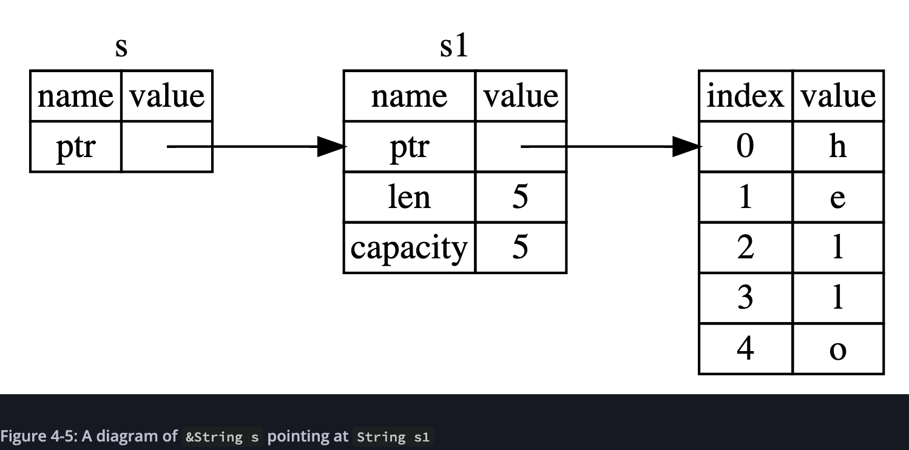

A reference is like a pointer in that it’s an address we can follow to access the data stored at that address; that data is owned by some other variable. Unlike a pointer, a reference is guaranteed to point to a valid value of a particular type for the life of that reference.




Mutable references tem uma grande restricão: Se voce tem uma mutable reference para um valor, voce nao pode ter nenhuma outra referencia para esse valor


Isso ocorre para previnir data races, que é as 3 situacoes ocorrendo:

- Two or more pointers access the same data at the same time.
- At least one of the pointers is being used to write to the data.
- There’s no mechanism being used to synchronize access to the data.


Mesmo caso tenha no escopo outra referencia sem ser a referencia mutavel, nao ocorre problema caso nao essas outras referencias nao sejam utilizadas ao mesmo tempo que a referencia mutavel

```rust
let mut s = String::from("hello");

let r1 = &s; // no problem
let r2 = &s; // no problem
println!("{} and {}", r1, r2);
// variables r1 and r2 will not be used after this point

let r3 = &mut s; // no problem
println!("{}", r3);
```

Rust nao deixa ser criado dangling references (ponteiro para um local desalocado) como:


The Rules of References
Let’s recap what we’ve discussed about references:

At any given time, you can have either one mutable reference or any number of immutable references.
References must always be valid.