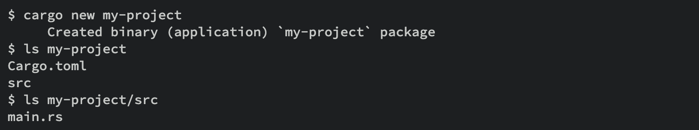

# Crate

Crate é a menor parte de codigo considerado pelo compilador.
Crate pode conter modulos que podem estar em outros arquivos que vao ser considerados na hora da compilacao

2 tipos de crates:

- binary crate
- library crate

## binary crate

Devem possuir uma main

## binary crate

Não tem main e nao viram um executavel
Geralmente quando usamos crate, estamos falando em library crate...

## crate root 

É o arquivo o que o compilador inicia a execucao e considera o modulo root da sua crate.

# Package

É um conjunto de uma ou mais crate que fornecem uma funcionalidade
Contem um cargo.toml que define como construir essas crates
- Um pacote pode conter quantas crates desejar.
- Um pacote pode conter apeans uma library crate
- Um pacote deve conter sempre ao menos uma crate seja binario ou library

Ao rodar cargo new, será criado um pacote (Por isso exite um cargo.toml).
Por convencao, "src/main.rs" sera a crate root de uma binary crate, que terá o mesmo nome do pacote. No caso usando cargo new [nome_do_pacote] ja será criado nesse formato. significando que "nome_do_pacote" sera a unica crate do pacote com mesmo nome.
Um pacote terá varios binary crates, colocando arquivos em "src/bin"

Da mesma forma, cargo sabe que se o pacote tiver o arquivo src/lib.rs, o pacote tem uma library crate com o mesmo nome do pacote e src/lib.rs sera a crate root.

Cargo informa para o rustc a crate root, para o build ser efetuado.

