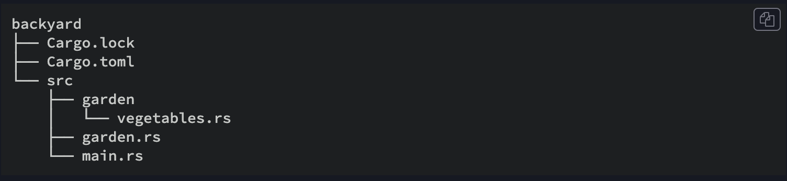

# Modules Cheat Sheet

- Comece da crate root, o compilador procura iniciar (geralmente src/lib.rs fpara library crate ou src/main.rs para binary crate)
- No arquivo de crate root, declara-se novos modulos filhos. Ex: modulo "garden". `mod garden;` O compilador ira procurar em:
    - Inline, usando chaves ao inves de ; 
    - No arquivo src/garden.rs
    - No arquivo src/garden/mod.rs (Geralmente se usa quando o modulo so criara outros submodulos)
- Pode se criar um submodulo. Por exemplo: declarar `mod vegetables;` dentro de "src/garden.rs". O compilador irá procurar o submodulo dentro do diretorio com o nome do modulo pai nesses lugares:
    - No arquivo src/garden/vegetables.rs
    - In the file src/garden/vegetables/mod.rs

- Para referenciar o modulo respeitando as regras de privacidade utiliza o caminho `crate::garden::vegetables::Asparagus`
- Codigo em um modulo é privado para os parents por default
- o use keyword evita utilizar o caminho todo de modulos

Exemplo do caso acima usando um crate binaria chamada backyard:




Filename: src/main.rs

```rust
use crate::garden::vegetables::Asparagus;

pub mod garden;

fn main() {
    let plant = Asparagus {};
    println!("I'm growing {:?}!", plant);
}
```

Filename: src/garden.rs

```rust
pub mod vegetables;
```

Filename: src/garden/vegetables.rs is included too

```rust
#[derive(Debug)]
pub struct Asparagus {}
```