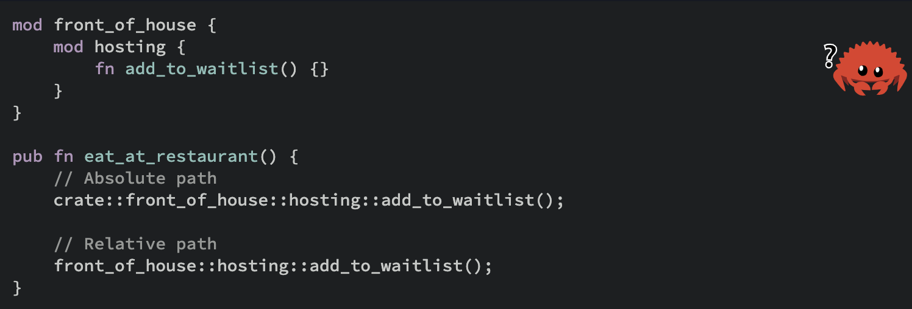
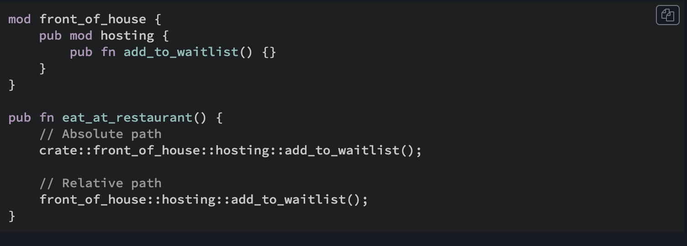

Quando se usa `crate` para se referir em algo no modulo. Está se usando o caminho absoluto.

Por padrao parents nao enxargam o que o modulo filho contem. A nao ser usando pub no mod e nos items dentro do modulo.

Por exemplo isso nao compila:





Para compilar devemos usar pub tanto no modulo quando na funcao a ser utilizada pelo parent.

## Super

Usando super, voltamos um nivel de modulo para obter algo(em que não é necessario deixar publico)

```rust
fn deliver_order() {}

mod back_of_house {
    fn fix_incorrect_order() {
        cook_order();
        super::deliver_order();
    }

    fn cook_order() {}
}
```

