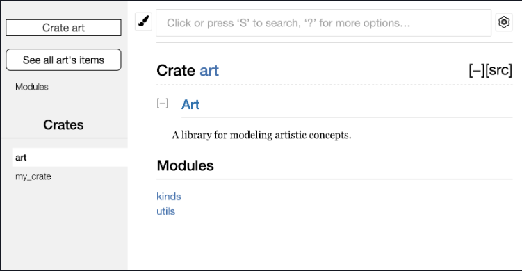
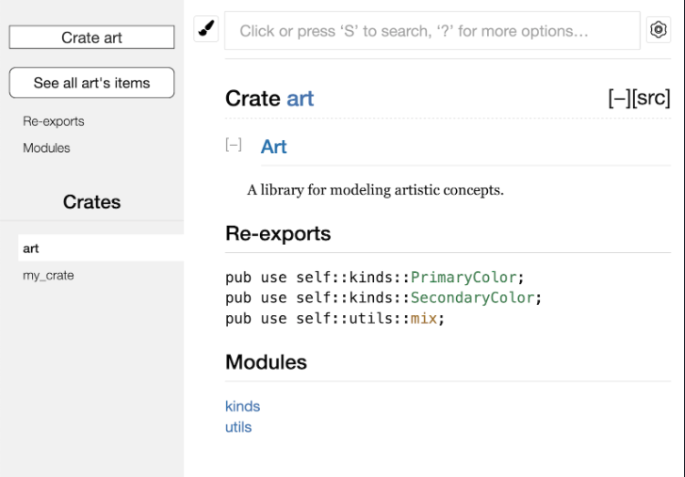

## Making Useful Documentation Comments

Documentation Comments usa `///`.

```rust
/// Adds one to the number given.
///
/// # Examples
///
/// ```
/// let arg = 5;
/// let answer = my_crate::add_one(arg);
///
/// assert_eq!(6, answer);
/// ```
pub fn add_one(x: i32) -> i32 {
    x + 1
}
```


`cargo doc` Vai gerar html com a documentacao em `target/doc`.

`cargo test` vai executar os testes dentro das documentation comments.

## Exporting a Convenient Public API with `pub use`

Utilizando `pub use`, estamos dizendo que quem está lendo a crate atual (ou u modulo) que vai ter acesso direto a um modulo filho sem precisar percorrer todo o caminho.


Considerando: src/lib.rs

```rust
//! # Art
//!
//! A library for modeling artistic concepts.

pub mod kinds {
    /// The primary colors according to the RYB color model.
    pub enum PrimaryColor {
        Red,
        Yellow,
        Blue,
    }

    /// The secondary colors according to the RYB color model.
    pub enum SecondaryColor {
        Orange,
        Green,
        Purple,
    }
}

pub mod utils {
    use crate::kinds::*;

    /// Combines two primary colors in equal amounts to create
    /// a secondary color.
    pub fn mix(c1: PrimaryColor, c2: PrimaryColor) -> SecondaryColor {
        // --snip--
    }
}
```

A doc será:



E para utilizar, que usa a crate vai precisar:

```rust
use art::kinds::PrimaryColor;
use art::utils::mix;

fn main() {
    let red = PrimaryColor::Red;
    let yellow = PrimaryColor::Yellow;
    mix(red, yellow);
}
```

O src/lib.rs pode ser mudado para:

```rust
//! # Art
//!
//! A library for modeling artistic concepts.

pub use self::kinds::PrimaryColor;
pub use self::kinds::SecondaryColor;
pub use self::utils::mix;

pub mod kinds {
    // --snip--
}

pub mod utils {
    // --snip--
}
```

O doc vai mostrar os reimports:



E quem usa a crate poderá usar assim:

```rust
use art::mix;
use art::PrimaryColor;

fn main() {
    // --snip--
}
```

# Crates.io

Quando se tem uma conta em crates.io, pode se usar login tendo um token:

```
$ cargo login abcdefghijklmnopqrstuvwxyz012345
```

Exemplo de metadata em Cargo.toml: 

```rust
[package]
name = "guessing_game"
version = "0.1.0"
edition = "2021"
description = "A fun game where you guess what number the computer has chosen."
license = "MIT OR Apache-2.0"

[dependencies]
```

Para publicar 

```
cargo publish
```

