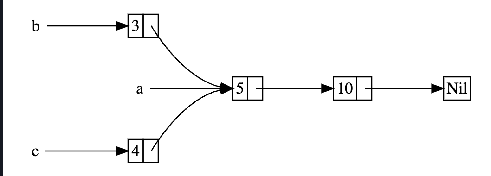

Podemos usar o `Rc<T>` quando queremos alocar algum dado na heap para varias partes do programa ler e nao podemos determininar em tempo de compilacao qque vai terminar de usar o dado por ultimo. Quando sabemos quem vai finalizar por ultimo, poderiamos simplemente fazer essa parte como owner.

**`Rc<T>` só pode ser utilizado com immutable references**

Queremos fazer isso:



Usando `Box<T>` Não vai funcionar:

```rust
enum List {
    Cons(i32, Box<List>),
    Nil,
}

use crate::List::{Cons, Nil};

fn main() {
    let a = Cons(5, Box::new(Cons(10, Box::new(Nil))));
    let b = Cons(3, Box::new(a));
    let c = Cons(4, Box::new(a));
}
```

```
$ cargo run
   Compiling cons-list v0.1.0 (file:///projects/cons-list)
error[E0382]: use of moved value: `a`
  --> src/main.rs:11:30
   |
9  |     let a = Cons(5, Box::new(Cons(10, Box::new(Nil))));
   |         - move occurs because `a` has type `List`, which does not implement the `Copy` trait
10 |     let b = Cons(3, Box::new(a));
   |                              - value moved here
11 |     let c = Cons(4, Box::new(a));
   |                              ^ value used here after move

For more information about this error, try `rustc --explain E0382`.
error: could not compile `cons-list` (bin "cons-list") due to 1 previous error
```

Se mudarmos a definicão de `List` para usar `Rc<T>`, as listas podem clonar o Rc que `a` esta segurando, fazendo incrementar o numero de referencias e deixando `a`, `b` e `c` compartilhar o ownership do dado. O dado so vai ser limpado quando tiverem 0 referencias a ele.

```rust
enum List {
    Cons(i32, Rc<List>),
    Nil,
}

use crate::List::{Cons, Nil};
use std::rc::Rc;

fn main() {
    let a = Rc::new(Cons(5, Rc::new(Cons(10, Rc::new(Nil)))));
    let b = Cons(3, Rc::clone(&a));
    let c = Cons(4, Rc::clone(&a));
}
```

Poderiamos ter usado `a.clone()`, mas a convenção do Rust diz para usar `Rc::clone`. A implementacao do `Rc::clone` nao faz um copia dos dados como a maioria das implementaçoes de clone, apenas incrementa o contador de referencias.


Podemos checar como o contador de referencia está:

```rust
fn main() {
    let a = Rc::new(Cons(5, Rc::new(Cons(10, Rc::new(Nil)))));
    println!("count after creating a = {}", Rc::strong_count(&a));
    let b = Cons(3, Rc::clone(&a));
    println!("count after creating b = {}", Rc::strong_count(&a));
    {
        let c = Cons(4, Rc::clone(&a));
        println!("count after creating c = {}", Rc::strong_count(&a));
    }
    println!("count after c goes out of scope = {}", Rc::strong_count(&a));
}
```

```
$ cargo run
   Compiling cons-list v0.1.0 (file:///projects/cons-list)
    Finished dev [unoptimized + debuginfo] target(s) in 0.45s
     Running `target/debug/cons-list`
count after creating a = 1
count after creating b = 2
count after creating c = 3
count after c goes out of scope = 2
```
